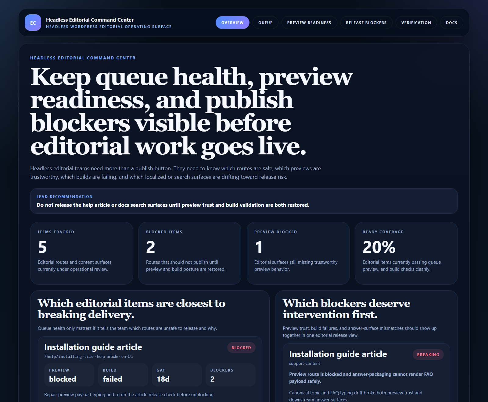
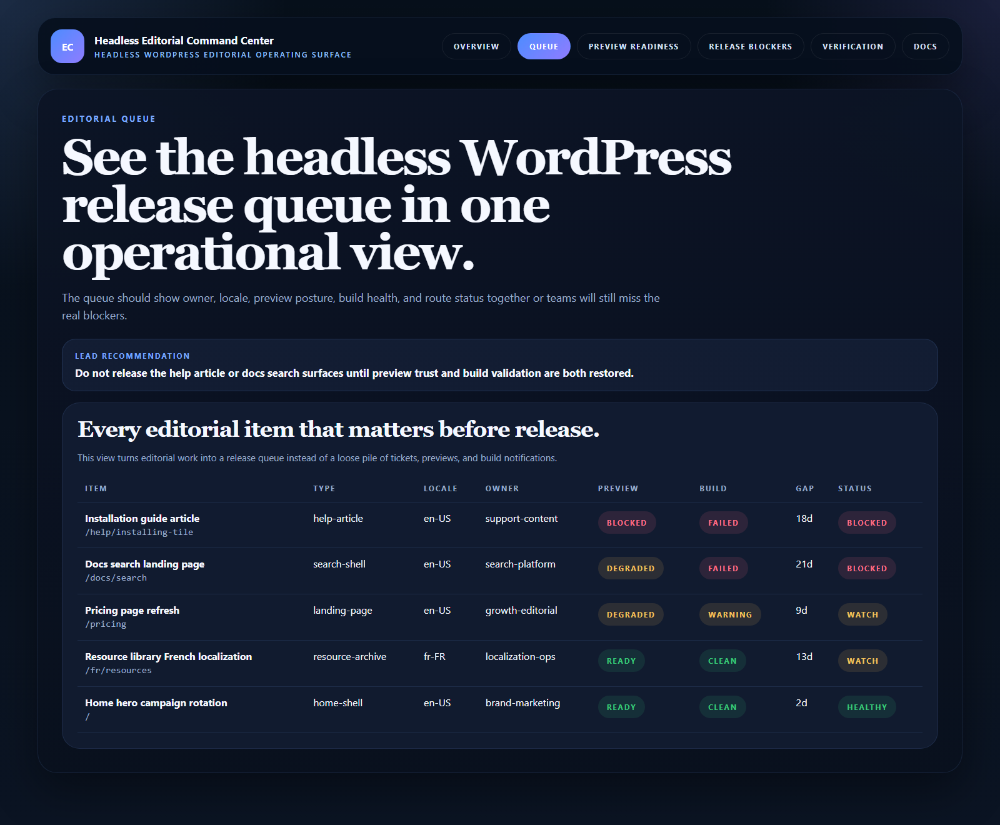
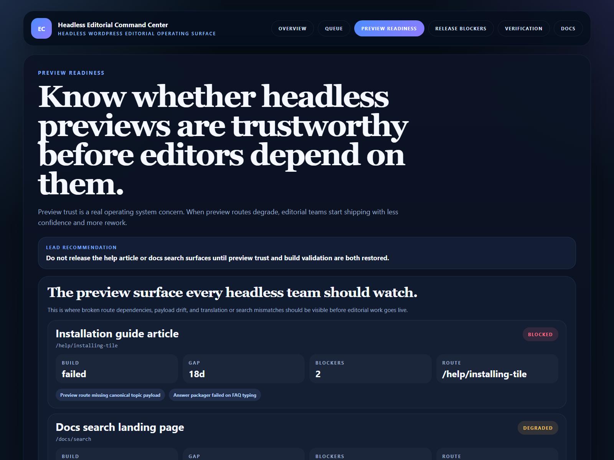
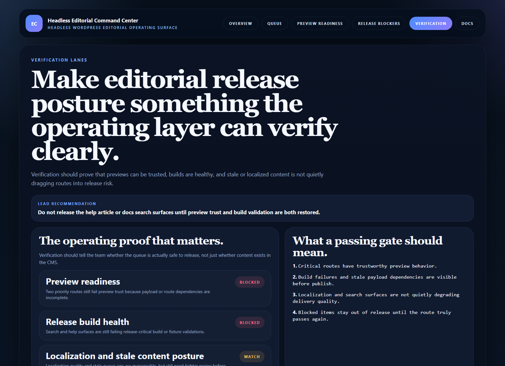

# Headless Editorial Command Center

TypeScript control surface for **running editorial queue health, preview readiness, build failures, and publish blockers across headless WordPress estates**.

> **What this repo proves**
>
> Headless editorial operations are not just about content entry. They are about knowing whether a route is safe to preview, build, localize, and release.

## Why this repo exists

Headless WordPress teams usually have pieces of editorial truth scattered everywhere: a CMS queue, preview links, build logs, localization notes, search issues, and release checklists. The problem is not a lack of data. The problem is the lack of one operating surface that makes route-level risk visible before a broken preview or failed build turns into a bad publish.

`headless-editorial-command-center` models that missing control plane. It tracks editorial queue items, preview trust, build posture, stale validation gaps, release blockers, and verification lanes in one place.

## Screenshots






## What it includes

- Express app with HTML proof surfaces and JSON APIs
- modeled editorial routes across marketing, help, search, and localization flows
- preview readiness and build health signals
- release blocker tracking tied to real route owners
- verification lanes for preview, build, and stale-content posture
- real browser-rendered README proof assets

## Local run

```powershell
cd headless-editorial-command-center
npm install
npm run dev
```

Open:

- [http://127.0.0.1:5238/](http://127.0.0.1:5238/)
- [http://127.0.0.1:5238/queue](http://127.0.0.1:5238/queue)
- [http://127.0.0.1:5238/preview-readiness](http://127.0.0.1:5238/preview-readiness)
- [http://127.0.0.1:5238/release-blockers](http://127.0.0.1:5238/release-blockers)
- [http://127.0.0.1:5238/verification](http://127.0.0.1:5238/verification)
- [http://127.0.0.1:5238/docs](http://127.0.0.1:5238/docs)

## Validation

```powershell
npm run verify
npm run render:assets
```

## API routes

- `GET /api/dashboard/summary`
- `GET /api/queue`
- `GET /api/preview-readiness`
- `GET /api/release-blockers`
- `GET /api/verification`
- `GET /api/sample`

## Docs

- [Architecture notes](./docs/architecture.md)
- [Why we built this](./docs/ORIGIN.md)
